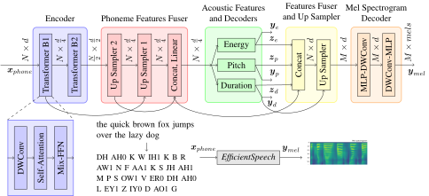

# EfficientSpeech: An On-Device Text to Speech Model

**EfficientSpeech**, or **ES** for short, is an efficient neural text to speech (TTS) model. It generates mel spectrogram at a speed of 104 (mRTF) or 104 secs of speech per sec on an RPi4. Its tiny version has a footprint of just 266k parameters - about 1% only of modern day TTS such as MixerTTS. Generating 6 secs of speech consumes 90 MFLOPS only. 

## Paper

- [IEEE Xplore](https://ieeexplore.ieee.org/abstract/document/10094639)
- [Arxiv](https://arxiv.org/abs/2305.13905)

## Model Architecture

**EfficientSpeech** is a shallow (2 blocks!) pyramid transformer resembling a U-Net. Upsampling is done by a transposed depth-wise separable convolution.



## Quick Demo

**Install**

**ES** is currently migrating to Pytorch 2.0 and Lightning 2.0. Expect unstable features.

```
pip install -r requirements.txt
```

If you encountered problems with cublas:

```
pip uninstall nvidia_cublas_cu11
```

**Tiny ES**

```
python3 demo.py --checkpoint https://github.com/roatienza/efficientspeech/releases/download/pytorch2.0.1/tiny_eng_266k.ckpt \
  --infer-device cpu --text "the quick brown fox jumps over the lazy dog" --wav-filename fox.wav
```

Output file is under `outputs`. Play the wav file:

```
ffplay outputs/fox.wav
```

After downloading the weights, it can be reused:

```
python3 demo.py --checkpoint tiny_eng_266k.ckpt --infer-device cpu  \
  --text "In additive color mixing, which is used for displays such as computer screens and televisions, the primary colors are red, green, and blue." \
  --wav-filename color.wav
```

Playback:

```
ffplay outputs/color.wav
```

**Small ES**

```
python3 demo.py --checkpoint https://github.com/roatienza/efficientspeech/releases/download/pytorch2.0.1/small_eng_952k.ckpt \
  --infer-device cpu  --n-blocks 3 --reduction 2  \
  --text "Bees are essential pollinators responsible for fertilizing plants and facilitating the growth of fruits, vegetables, and flowers. Their sophisticated social structures and intricate communication systems make them fascinating and invaluable contributors to ecosystems worldwide." \
  --wav-filename bees.wav
```

Playback:

```
ffplay outputs/color-small.wav
```


**Base ES**

```
python3 demo.py --checkpoint https://github.com/roatienza/efficientspeech/releases/download/pytorch2.0.1/base_eng_4M.ckpt \
  --head 2 --reduction 1 --expansion 2 --kernel-size 5 --n-blocks 3 --block-depth 3 --infer-device cpu  \
  --text "Why do bees have sticky hair?" --wav-filename  bees-base.wav
```

Playback:

```
ffplay outputs/bees-base.wav
```

**GPU** for Inference 

And with a long text. On an A100, this can reach RTF > 1,300. Time it using `--iter 100` option.

```
python3 demo.py --checkpoint small_eng_952k.ckpt  \
  --infer-device cuda  --n-blocks 3 --reduction 2  \
  --text "Once upon a time, in a magical forest filled with colorful flowers and sparkling streams, there lived a group of adorable kittens. Their names were Fluffy, Sparkle, and Whiskers. With their soft fur and twinkling eyes, they charmed everyone they met. Every day, they would play together, chasing their tails and pouncing on sunbeams that danced through the trees. Their purrs filled the forest with joy, and all the woodland creatures couldn't help but smile whenever they saw the cute trio. The animals knew that these kittens were truly the epitome of cuteness, bringing happiness wherever they went."   \
  --wav-filename cats.wav --iter 100
```

### Compile and Number of Threads Options

Compiled option is supported using `--compile` during training or inference. For training, the eager mode is faster. The tiny version training is ~17hrs on an A100. For inference, the compiled version is faster. For an unknown reason, the compile option is generating errors when `--infer-device cuda`.

By default, PyTorch 2.0 uses 128 cpu threads (AMD, 4 in RPi4) which causes slowdown during inference. During inference, it is recommended to set it to a lower number. For example: `--threads 24`.

### RPi4 Inference

PyTorch 2.0 is slower on RPi4. Please use the [Demo Release](https://github.com/roatienza/efficientspeech/releases/tag/demo-0.1-release) and [ICASSP2023 model weights](https://github.com/roatienza/efficientspeech/releases/tag/icassp2023).

RTF on PyTorch 2.0 is ~1.0. RTF on PyTorch 1.12 is ~1.7. 

Alternatively, please use the onnx version:

```
python3 demo.py --checkpoint https://github.com/roatienza/efficientspeech/releases/download/pytorch2.0.1/tiny_eng_266k.onnx \
  --infer-device cpu  --text "the primary colors are red, green, and blue."  --wav-filename primary.wav
```

### ONNX 

Only supports fixed input phoneme length. Padding or truncation is applied if needed. Modify using `--onnx-insize=<desired valu>`. Default max phoneme length is 128. For example:

```
python3 convert.py --checkpoint tiny_eng_266k.ckpt --onnx tiny_eng_266k.onnx --onnx-insize 256
```

### Dataset Preparation

Choose a dataset folder: eg `<data_folder> = /data/tts` - directory where dataset will be stored.

Download LJSpeech:

```
cd <data_folder>
wget https://data.keithito.com/data/speech/LJSpeech-1.1.tar.bz2
tar zxvf LJSpeech-1.1.tar.bz2
```

Prepare the dataset:  `<parent_folder>` -  where efficientspeech was git cloned.

```
cd <parent_folder>/efficientspeech
```

Edit `config/LJSpeech/preprocess.yaml`:

```
>>>>>>>>>>>>>>>>>
path:
  corpus_path: "/data/tts/LJSpeech-1.1"
  lexicon_path: "lexicon/librispeech-lexicon.txt"
  raw_path: "/data/tts/LJSpeech-1.1/wavs"
  preprocessed_path: "./preprocessed_data/LJSpeech"
>>>>>>>>>>>>>>>>
```

Replace `/data/tts` with your `<data_folder>`.

Download alignment data to `preprocessed_data/LJSpeech/TextGrid` from [here](https://drive.google.com/drive/folders/1DBRkALpPd6FL9gjHMmMEdHODmkgNIIK4?usp=sharing).

Prepare the dataset:

```
python3 prepare_align.py config/LJSpeech/preprocess.yaml
```

This will take an hour or so.

For more info: [FastSpeech2](https://github.com/ming024/FastSpeech2) implementation to prepare the dataset.

## Train

**Tiny ES**

By default:
  - `--precision=16`. Other options: `"bf16-mixed", "16-mixed", 16, 32, 64`.
  - `--accelerator=gpu`
  - `--infer-device=cuda`
  - `--devices=1`
  - See more options in `utils/tools.py`
  
```
python3 train.py
```

**Small ES**

```
python3 train.py --n-blocks 3 --reduction 2
```

**Base ES**

```
python3 train.py --head 2 --reduction 1 --expansion 2 --kernel-size 5 --n-blocks 3 --block-depth 3
```

## Comparison with other SOTA Neural TTS

[ES vs FS2 vs PortaSpeech vs LightSpeech](https://roatienza.github.io/efficientspeech-demo/)

## Credits

- [FastSpeech2 Unofficial Github](https://github.com/ming024/FastSpeech2).


## Citation
If you find this work useful, please cite:

```
@inproceedings{atienza2023efficientspeech,
  title={EfficientSpeech: An On-Device Text to Speech Model},
  author={Atienza, Rowel},
  booktitle={ICASSP 2023-2023 IEEE International Conference on Acoustics, Speech and Signal Processing (ICASSP)},
  pages={1--5},
  year={2023},
  organization={IEEE}
}
```
